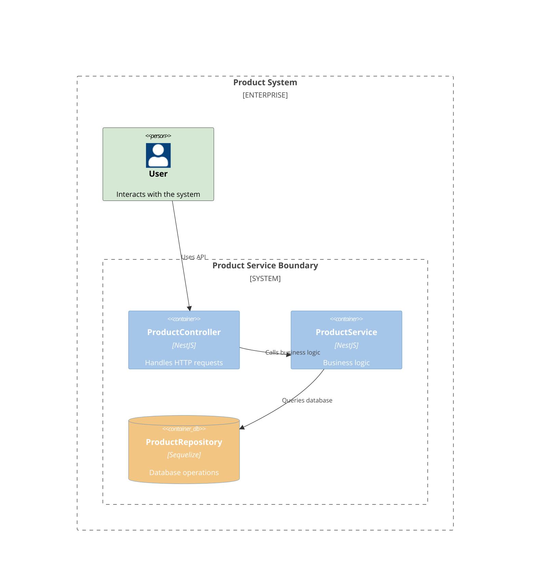

# 1. Solução
As funcionalidades deverão ser disponibilizadas através de API RESTful.


# 2. Desenho arquitetural do software


# 3. Estrutura de Pastas

```
📂 nestjs-mvc-project
├── 📁 src
│   ├── 📁 product
│   │   ├── 📄 product.controller.ts   # Controlador para gerenciar requisições HTTP
│   │   ├── 📄 product.service.ts      # Lógica de negócio para produtos
│   │   ├── 📄 product.repository.ts   # Interação com o banco de dados
│   │   ├── 📄 product.model.ts        # Definição da entidade Product
│   │   ├── 📄 product.module.ts       # Módulo NestJS para encapsular a funcionalidade
│   │   ├── 📄 dto
│   │   │   ├── create-product.dto.ts  # DTO para criação de produto
│   │   │   ├── update-product.dto.ts  # DTO para atualização de produto
│   │   └── 📄 interfaces
│   │       ├── product.interface.ts   # Interface para tipagem da entidade
│   │       └── product.repository.interface.ts  # Interface para o repositório
│   ├── 📄 app.module.ts                # Módulo principal da aplicação
│   ├── 📄 main.ts                      # Ponto de entrada da aplicação NestJS
```

# 4. Explicação dos componentes
## product.model.ts 
Define a estrutura da entidade Product.

## product.controller.ts  
Controlador que recebe e processa requisições HTTP.

## product.service.ts 
Contém a lógica de negócio e orquestra chamadas ao repositório.

## product.repository.ts
Responsável por interagir com o banco de dados.

## dto/
Armazena os Data Transfer Objects (DTOs) para validação de entrada de dados no controller.

# 5. Entrega do Código

O codigo esta disponivelno [Github](https://github.com/Jamesasj/bootcamp-arq-soft-xpe-final)

# 6. Project setup

```bash
$ npm install
```

## Compile and run the project

```bash
# production mode
$ npm run start:prod
```
